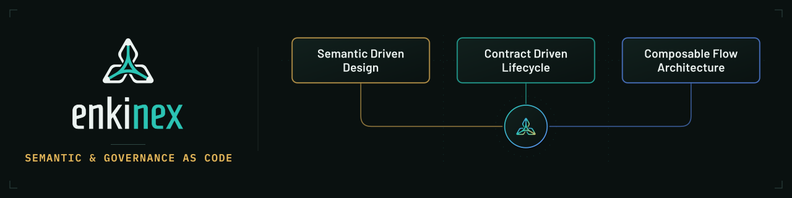

[](https://enkinex.org)

# Enkinex ODCS — Data Contract as Code Library

[](https://github.com/bitol-io/open-data-contract-standard/tree/v3.1.0)
[](https://www.kcl-lang.io/)
[](./CHANGELOG.md)
[](./LICENSE)

> A modular [KCL](https://www.kcl-lang.io/) implementation of the
> [Open Data Contract Standard (ODCS) v3.1.0](https://github.com/bitol-io/open-data-contract-standard/tree/v3.1.0),
> built to author, type-check, and validate data contracts as **Governance-as-Code**.

---

## Project Summary

The Open Data Contract Standard (ODCS), a [Linux Foundation AI & Data Incubation project](https://bitol.io/), is a
community-driven standard distributed as a JSON schema definition and usually authored as a single YAML document. While
YAML is a popular format for organizing data, configuring applications, and controlling automation scripts, it has major
maintainability challenges.

**Enkinex ODCS** complements the standard by expressing it as a modular KCL schema library. It defines an engineering
layer on top of ODCS that keeps the standard intact while adding code-level ergonomics. By defining the data contract as
a code project, we are able to mitigate specific challenges:

* Modularity & reuse: schemas, imports, and packages instead of copy-paste YAML.
* Type safety & constraints: invalid contracts fail at compile time, not in production.
* Two-way validation: validate existing ODCS YAML and author new contracts in typed KCL.
* Living documentation: a schema reference generated straight from the code.

---

> [!IMPORTANT]
> **Backward Compatibility Disclaimer.**
> - **Enkinex ODCS `v3.1.0`** implements the current **ODCS v3.1.0** and does **not** aim to provide earlier ODCS versions.
> - **Deprecated definitions are omitted** (e.g. `dataProduct`, `slaDefaultElement`).

---

## Table of Contents

- [Why KCL as a Governance-as-Code DSL](#why-kcl-as-a-governance-as-code-dsl)
- [How the ODCS standard was mapped to KCL schemas](#how-the-odcs-standard-was-mapped-to-kcl-schemas)
- [Getting Started with Enkinex ODCS](#getting-started-with-enkinex-odcs)
- [Schema Library Reference](#schema-library-reference)
- [Schema Library Commands](#schema-library-commands)
- [External References and Resources](#external-references-and-resources)
- [Contributing](#contributing)
- [License](#license)

---

## Why KCL as a Governance-as-Code DSL

The **Enkinex ODCS** library was created to solve a real problem: building **data product** projects across many
domains, where each domain manages dozens of **data contracts**. YAML does not scale well and does not provide
**computational governance** on its own. Tools like the [Data Contract CLI](https://cli.datacontract.com/) validate and
integrate ODCS well, but they do not provide the ability to scale **governance-as-code** in a GitOps operation using a
DSL made for that purpose.

The idea came from earlier experience using KCL to model Kubernetes applications deployed with Crossplane and Argo CD:
KCL behaved for configuration and policy the way HCL does for IaC. Applied to data contracts, KCL opens up possibilities
that flat YAML cannot:

- **Reusable Domain Libraries**: package data-quality rules, PII/privacy policies, and ownership rules into shared
  schema modules that many contracts import and specialize.
- **Reusable Server Catalogs**: define organization-wide, domain-specific, and environment-restricted server
  configurations (sources and targets) once, and reference them across contracts.
- **Enterprise Conventions Enforced in CI/CD**: use custom settings and `check` rules to enforce naming conventions and
  create standard, organized, machine-readable IDs for IT resources, applications, and data models (IDs, catalogs,
  tables, rules, …).
- **Export to the wider toolchain**: export dynamically generated governance parameters to Terraform, Argo CD, or
  Crossplane, lowering IaC complexity and removing the need for extra parsers and custom CLIs.
- **Better AI & Spec-Driven Workflows**: a well-typed, well-documented KCL schema adds a layer of declarative semantics
  that improves AI code assistants, spec-driven design, and overall project-lifecycle management.

---

## How the ODCS standard was mapped to KCL schemas

The standard ODCS JSON Schema already organizes its definitions into sections (fundamentals, schema/catalog, servers,
quality, roles/teams, SLAs, …). **Enkinex ODCS** keeps that grouping, but treats it as an **opinionated** software
engineering decision: the contract is designed as a **library** where **modularity** and **maintainability** are
first-class requirements, so each section becomes a KCL module (a directory of related schemas) that other modules
import.

The library is composed of six modules plus a root contract:

| Module                | Purpose                                                                                                                                                   | Detailed docs                                     |
|-----------------------|-----------------------------------------------------------------------------------------------------------------------------------------------------------|---------------------------------------------------|
| **`common`**          | Cross-cutting building blocks reused everywhere. Most code-reuse decisions live here and are inherited by the other modules.                              | [docs/schemas/common](docs/schemas/common.md)     |
| **`catalog`**         | The dataset shape: schema objects (tables, topics, files), their properties (columns/fields), per-logical-type options, and relationships (foreign keys). | [docs/schemas/catalog](docs/schemas/catalog.md)   |
| **`contract`**        | Contract-level metadata: description, pricing, SLAs, and support channels.                                                                                | [docs/schemas/contract](docs/schemas/contract.md) |
| **`iam`**             | Access and ownership: role, team, and team member.                                                                                                        | [docs/schemas/iam](docs/schemas/iam.md)           |
| **`quality`**         | Data-quality rules and their comparison operators.                                                                                                        | [docs/schemas/quality](docs/schemas/quality.md)   |
| **`server`**          | Connection details: the server definition plus 30+ typed server subschemas (postgres, bigquery, snowflake, kafka, s3, …).                                 | [docs/schemas/server](docs/schemas/server.md)     |
| **`odcs.k`** *(root)* | The root **`DataContract`** schema. It imports from every module and composes them into the final ODCS contract definition.                               | [docs/schemas/odcs](docs/schemas/odcs.md)         |

---

## Getting Started with Enkinex ODCS

Learn from the **[Enkinex ODCS Tutorial](https://enkinex.org/docs/governance/odcs/tutorial/)** how to write a data
contract as a code project and export it to a YAML document.

**What you are going to learn:**

1. **Installing KCL**: set up the KCL CLI on your machine.
2. **Creating the Contract Project Module**: initialize a KCL module, depend on `enkinex-odcs`, and lay out a modular
   project.
3. **Declare the Contract KCL Code**: author the contract as small, reusable typed KCL sources.
4. **Parse and Export to YAML**: validate, print, and export the contract to YAML or JSON.

---

## Schema Library Reference

The complete, per-schema API reference is **auto-generated by the KCL CLI**
from the schema docstrings and property definitions:

**➡ [Enkinex ODCS Schemas Reference](docs/library/odcs.md)**

Regenerate it after any schema change with:

```bash
just docs      # runs: kcl doc generate --escape-html
```

---

## Schema Library Commands

Common tasks are wrapped in the [`Justfile`](Justfile):

```bash
just init      # sync library module dependencies
just test      # kcl vet the contract + fixtures against the schemas
just docs      # regenerate docs/library/odcs.md from the schema docstrings
```

---

## External References and Resources

- **Open Data Contract Standard (ODCS) v3.1.0**: the
  standard [GitHub project](https://github.com/bitol-io/open-data-contract-standard/tree/v3.1.0).
    - Standard JSON Schema: [`odcs-json-schema-v3.1.0.json`](odcs-json-schema-v3.1.0.json)
- **[KCL Language](https://www.kcl-lang.io/)**: the configuration & policy DSL used for the implementation.
- **[Data Contract CLI](https://cli.datacontract.com/)**: open-source command-line tool for working with data contracts.

---

## Contributing

Contributions are welcome — see [CONTRIBUTING.md](CONTRIBUTING.md) and the contributor list in [AUTHORS.md](AUTHORS.md).

---

## License

Licensed under the Apache License 2.0 — see [LICENSE](LICENSE).